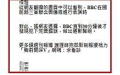
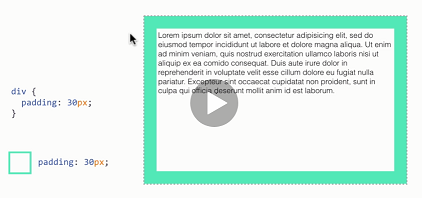
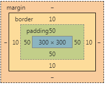
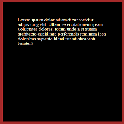

# 網頁排版 筆記

## Abstract

* [原本的CSS會有預設值，要用css Reset 更改](https://meyerweb.com/eric/tools/css/reset/)

## <font color = 'aqua'>1.區塊元素display: block</font>:
>1. 在網頁檢查 -> html-> style-> display: block;區塊元素
    或是compute的圖 block:數字 inline:auto
>2. 預設會盡可能佔滿版(一整行) 用 width(寬度): 300px; 做剪裁(可修改)
>3. 但display:block 會另起一行來呈現
>4. 包含h系列、ul系列、p段落

```css
h1 { /*區塊 改 行內*/
    background: grey;
    color: honeydew;
    display: inline; /*這裡*/
```
---
## <font color = 'aqua'>2.行內元素display: inline</font>:
>1. 他是一行一行呈現的，比較常用在行內裡面
>2. "span" 標籤本身不具任何意義，<font color = 'red'>只是拿來做排版點綴使用(也是行內元素)</font>
>3. 包含 a 、span
>4. inline預設無法設定'寬高'，只能改成display:block

```css
a{  /*行內 改 區塊 */
    width: 300px;
    height: 200px;
    display:block; /*這裡*/
}
```
---
## <font color = 'aqua'>3.div標籤&後代選擇器 :</font>
>1. div 是一個沒有語意，單純拿來排版的標籤，是一個大的容器(父層)。
>2. 新!<font color = 'orange'>後代選擇器(父層):</font>把class放到div標籤裡面


``` html
<div class="style2"> 
    <a href="#">title</a>
    <a href="#">title</a>
    <a href="#">title</a>
</div>
```
```css
.style2 a {  /*要註明是div哪一個標籤要更改，如a (要寫名字)*/ 
    color: whitesmoke;
    background-color: black;
```
>1. div大容器裡面活用小class所示:
>2. 要注意div大容器要寫名字，小class不用

```html
<div class="style2"> 
    <p class="content"> 段落粗體 </p>
    <p>段落粗體</p>
    <p>段落粗體</p>
</div>
```
```css
.style2 .content{
    color: red;
}
```
---
## <font color = 'aqua'>3.margin & padding 空格推來推去 :</font>

>1. margin 為向外推 <-- | padding 是向內推 -->
>2. 他有強調盡量不要寫死 height高度 ，讓他自己適應
```html
<div class="box">
    <p>從網友翻攝的畫面中可以看到，BBC在國防部三軍聯合樂儀隊進行表演時 </p>
    <p>對此，據網友透露，BBC直到30分鐘後才發現犯下荒唐錯誤，做出道歉聲明。</p>
    <p>更多鏡週刊報導
    護理師抱怨新制服擾視力 「胸前開深V」網喊：求看診
    </p>
</div>
```
```css
.box {
    width: 300px; /*總寬度*/
    margin-left: 30px; /*往左向外推*/ 
    border:5px brown solid ; /*畫線框起來*/
    padding-left: 30px; /*框框裡面向內推*/

}
.box p {  /*p 元素為區塊元素會自己適應父代box所設定*/
    margin-bottom: 30px; /*行間往下推，產生間隔*/
    font-weight: bold;  /*粗體*/
}
```




## <font color = 'aqua'>4.model box 盒模型 & margin auto自動對齊 :</font>

```css
.box {
    width: 300px; /*1.內層*/
    height: 300px; /*1.內層*/
    border:10px brown solid ; /*3.線框*/
    padding: 50px;  /*2.padding*/
    background: black;
    color: blanchedalmond;
    /*4.還有一個margin層*/
    /* 總共是300+50*2+10*2 = 420 (如左下)
```
 

```css
.wrap {
    width: 100px;
    height: 100px;
    background: black;
    margin-left: auto;  /* 產生一個框框 自動對齊正中心*/
    margin-right: auto;  /* 產生一個框框 自動對齊正中心*/
}
```


## <font color = 'aqua'>5.各類實作及文字置中部分:</font>

>1. 呈現父div包含三個子div

```html
<body>
    <div class="wrap"> <!--父-->
        <div class="header"></div> <!--子-->
        <div class='content'> <!--子-->
            <p>Lorem ipsum dolor sit amet consectetur adipisicing elit. Voluptate, asperiores.</p>
        </div>
        <div class="footer"> <!--子-->
           <p>世界之心 <br> TEL:487</p> <!-- <br> 換行-->
    </div>
</body>
```
```css
.wrap { /*父*/
    width: 200px;
    height: 150px;
    background: black;
    margin-left: auto;
    margin-right: auto;
}
.header {
    height: 50px;
    background: yellow;
    
}
.content {
    height: 50px;
    padding: 10px; /*中間內推10px*/
    background: aqua;

    
}

.footer {
    padding-top: 10px;  /*上下各推10px*/
    padding-bottom: 10px;
    text-align: center; /*文字置中*/
    background: pink;
    }
```
## <font color = 'aqua'>6.如果不想去計算模型寬長高等等:</font>

>1. 就使用box-sizing:border-box;
>2. 還有一個通用的  在下面


```html
<div class="box"></div>
```
```css
.box {
    width: 200px;
    height: 300px;
    border:10px brown solid ;
    padding: 50px;
    background: black;
    box-sizing: border-box; /*加這行進去 width 是多少她全部就會自動調整為多少*/
```
```css
*,*:before,:after{
    box-sizing: border-box;
} /*全部網頁都會按照這個規矩來 看父 width !!*/
